
<h1 style="font-family: courier;" align="center">LaserDuo</h1>

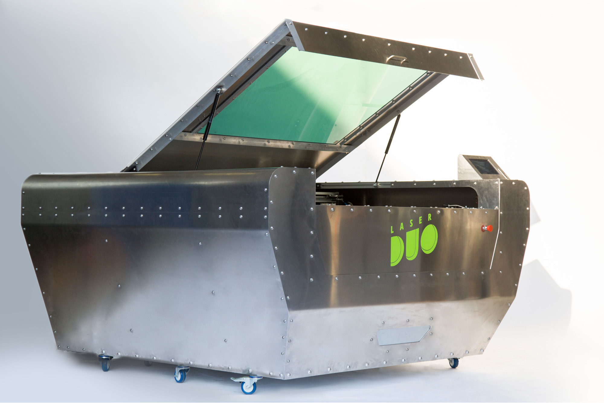

<i>Open Source Dual Laser Cutter</i>

Premises
--
We dream in a future of freedom, where open source hardware and [Fab Labs](https://fablabs.io/) enable people to fully understand how to make things they need, and where decentralized local production is customized to impact the surrounding community. Believing that empowering the user with knowledge about how to make machines, LaserDuo wants to give to the world a powerful open source tool, to lasercut (almost) any material. And, together with [BigFDM](https://github.com/fab-machines/BigFDM), this is one of the first steps in developing other machines sharing the same philosophy.

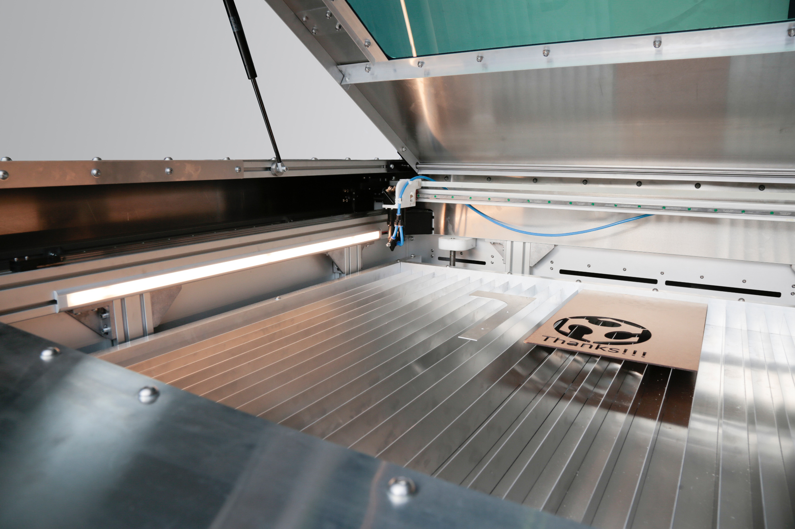

LaserDuo
--
LaserDuo is an open source laser cutter having two different laser sources. Using a 130W CO2 and a 75W YAG lasers, LaserDuo can work with a wide range of materials such as wood and metals.

Taking advantage of what we have learned in [Fab Academy](https://fabacademy.org/), LaserDuo has been developed using standard [Fab Lab equipment](https://docs.google.com/spreadsheets/d/1U-jcBWOJEjBT5A0N84IUubtcHKMEMtndQPLCkZCkVsU/pub?single=true&gid=0&output=html) and [techniques](http://fab.academany.org/2019/schedule.html) plus a membrane press machine to bend the aluminum parts. LaserDuo was developed at [Fab Lab Kamp-Linfort](https://fablab.hochschule-rhein-waal.de/about-us) by Daniele Ingrassia. Reversing the consumer process, where knowledge and building of machines stays inside a black box managed by companies, LaserDuo brings the advantages of an open source development:

- full awareness about how the machine works
- reproducible design
- possibility to customize the machine and/or to build new ones
- built as much as possible with local materials
- local self-fixing and self-production of the machine parts
- community can use and improve the design
- cheap alternative to large scale 3D printers
- use LaserDuo as tool to produce other open source machines

Developed and built in a Fab Lab as multipurpose machine, LaserDuo allows to access the laser cutting technology at lower price in comparison to similar machines available on the market. Especially considering the possibility to work with metals. The open source design allows the user to fix the machine by himself, and to be aware of the process in a way that he can use it to reproduce the machine or parts for it. Being a challenging project from several aspects, such as size of the working area, Z-axis, speed, resolution and the dual laser, it also offers additional features like an integrated PC to control the machine and launch jobs, air assist, solid aluminum bodywork.

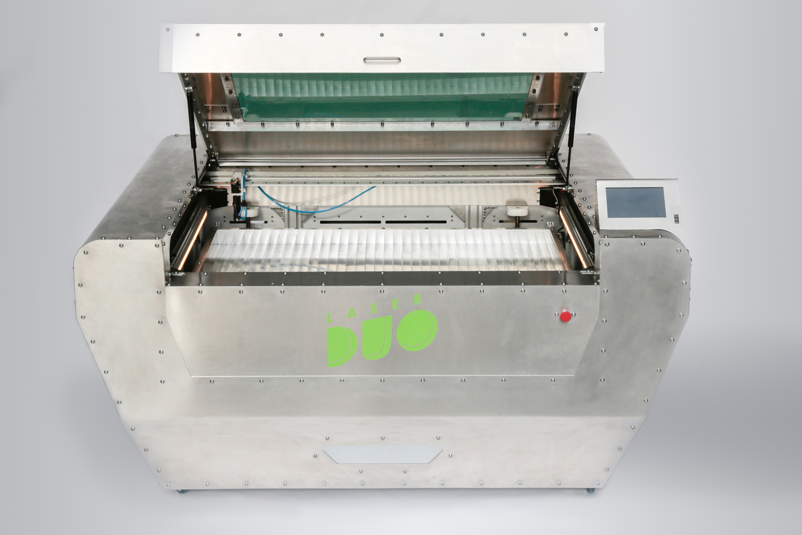

**LaserDuo specifications**:

- **1500mm x 1000mm** cutting area
- **500mm Z axis**
- **dual laser source**
- **130W CO2** laser
- **75W YAG** laser
- **800mm/s** maximum speed
- **Nema 24** stepper motors
- **air assist**
- integrated **tablet** for machine control
- **1000DPI or 0.0254mm** resolution
- open source **satshakit biards** for machine control
- dedicated sealed **exhaust chamber**
- **certified laser protective window**
- **safety features** emergency switch, windows interlock
- **fully enclosed 100% aluminum housing**
- dimensions: 2250mm x 2100mm x 1500mm

Machine design
--
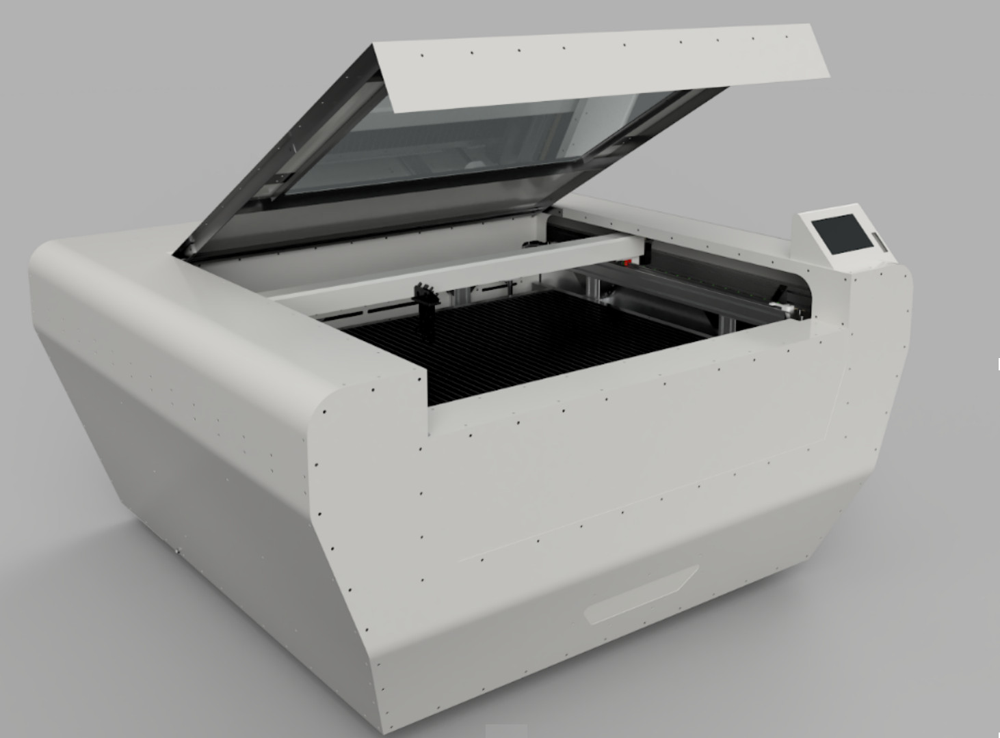

The overall project has been designed by following a bottom-up approach, where the first step was to make a single machine axis. Every step focused on developing a single machine section, designing and constraining it according to the previous steps and machine features. You can consider this like being almost blind about the next step, until the current one has been assessed as able to work properly. It is therefore for me still astonishing the complete transition to the final machine look, generated by the chaining of the dependencies of several design steps.

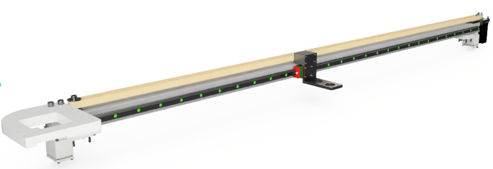

X and Y stages
--

As many other laser cutters, also the stages of LaserDuo have been designed to be light and fast. Linear rails together with CNC milled POM and aluminium profiles have been used. To be noticed this step took a lot time, especially during the assembly to ensure the correct squareness of the frame and the perpendicularity of the axis. Both X and Y axis are moved by Nema 24 motors.

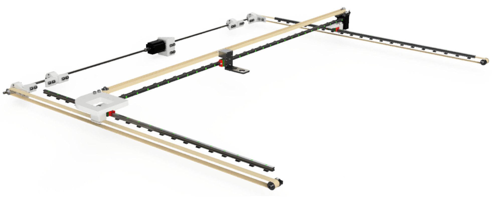

Z Axis
--

I always had something to do with lasers having Z axis, before learning that some chinese laser don’t have it. Therefore for me was quite normal to consider to have it. However I had a long reasoning about the justification of the extra costs vs the possible benefits. Then I had the idea to eventually make a 3D printer as a possible upgrade for LaserDuo, while considering that I still needed to find a solution to properly take the focus by moving the lens up and down. That convinced me to add it. The Z axis consist of 4 lead-screws, supported by ball bearings and moved a closed loop belt. The frame has been designed in a way to fit the Z axis inside and to have the machine high enough to be on wheels.

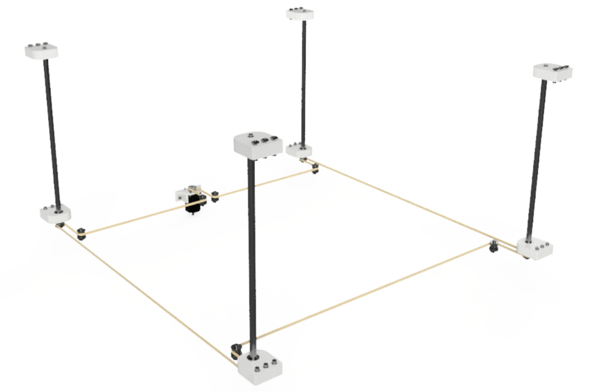

Inner enclousure
--

Designed on purpose to shield the laser focusing area and to make the fumes having a certain flow towards the exhaust system, the inner enclosure consists of CNC milled 1.5mm anodized aluminium sheets. There are vents both in the front and the back, allowing fresh air to come from outside, cool the cutting area, and be exhausted through a sealed box.

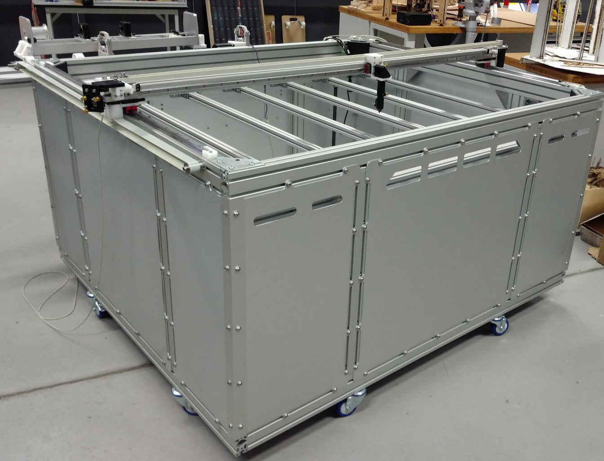
   
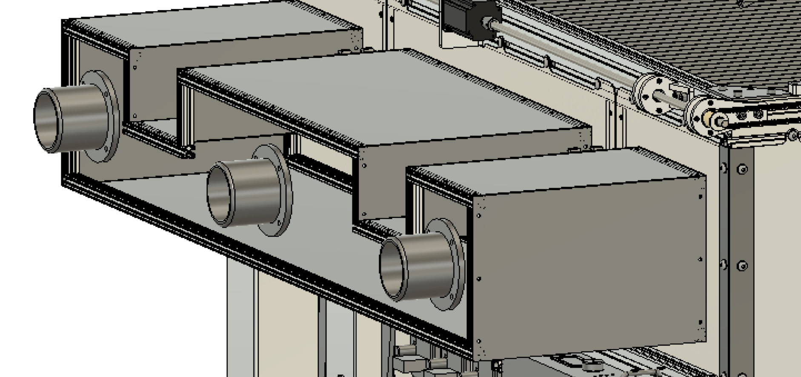

Housing
--

The housing completely encloses the machine, while keeping 3 exhaust tubes in the back and some ultrathin air intakes. The design uses curves to allow the feet to fit when coming close to the machine, and as well to save material. Laser, exhaust, electronics and optics are located in different areas, accessible by removing a specific panel for maintenance.

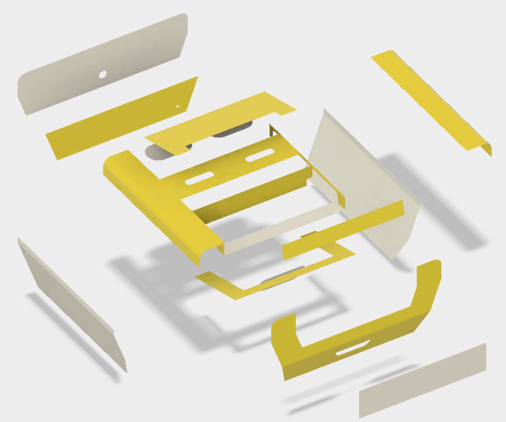
   
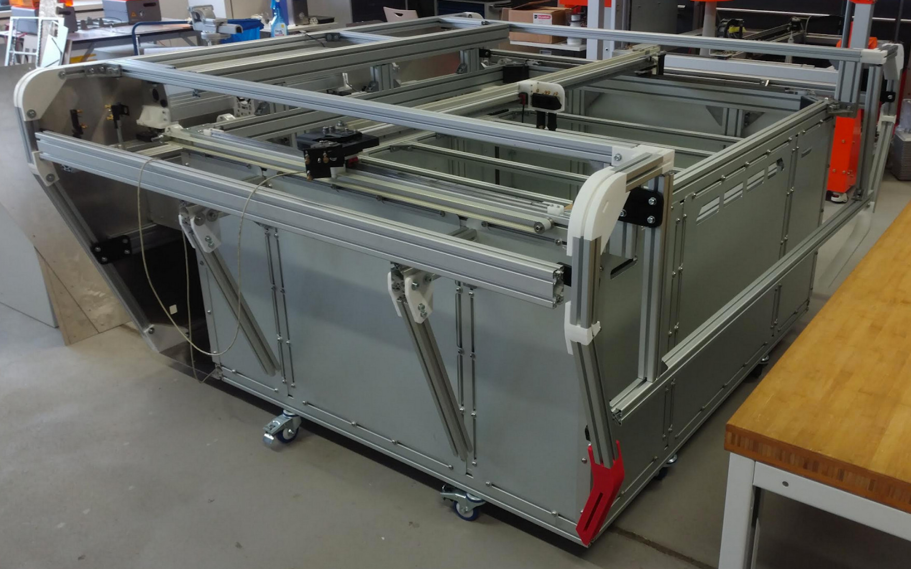
   
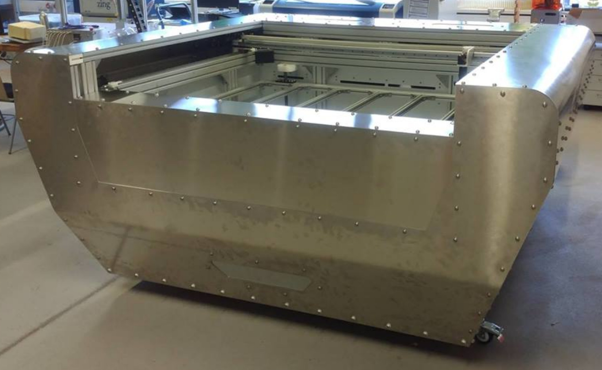

Electronics
--
The electronics of LaserDuo consists of a set of fabbable electronics, derived from the original **[satshakit](https://github.com/satshakit)** board and **[satstep](https://github.com/satstep)** stepper drivers. Following the used boards and their role in LaserDuo. 

**[satshakit-mega](https://github.com/fab-machines/LaserDuo/tree/master/electronics/satshakit-mega)**

Based on the [ATMega2560](https://www.microchip.com/wwwproducts/en/ATmega2560), this board provides the necessary microcontroller hardware to manage LaserDuo dual laser logic and additional sensors. Furthermore integrates an USB-to-Serial converter and USB port. Developed as general purpose board, not all the pins will be used. In the future this board will be a custom made solution for LaserDuo. Link to the original [repo](https://github.com/satshakit/satshakit-mega).

---------

**[satshakit-grbl](https://github.com/fab-machines/LaserDuo/tree/master/electronics/satshakit-grbl)**

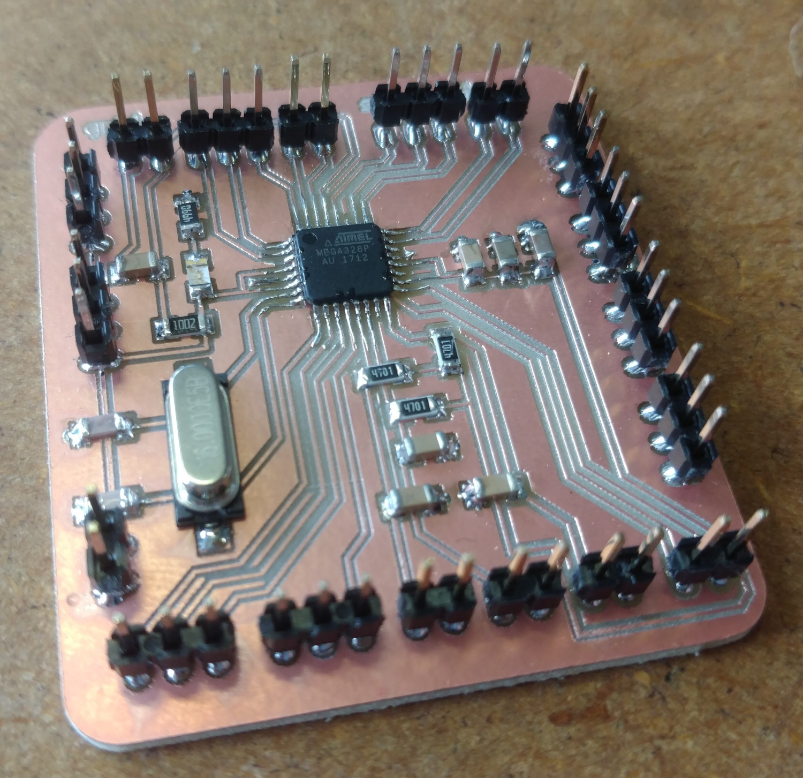

Used to run **[GRBL 1.1](https://github.com/gnea/grbl)** in laser mode, satshakit-grbl is based on the ATMega328p and as well integrates nise filtering for the endstops. Link to the original repo [satshakit-grbl](https://github.com/satshakit/satshakit-grbl)

---------

**[satstep6600](https://github.com/fab-machines/LaserDuo/tree/master/electronics/satstep6600)**

Proved to have a robust design by being used in **[LaserDuo](http://laserduo.com/)** for more than a year, the satstep6600 is the stepper driver used to move the NEMA 24. Based on the Toshiba [TB6600HG](http://www.massmind.org/images/massmind/TB6600HG_datasheet.pdf) it can give up to 4.5A per coil to a single motor, whereas the NEMA 24 used will take a maximum of 4A. Link to the original [repo](https://github.com/satstep/satstep6600).

---------

Summary of the needed boards:

- 1 x satshakit-mega
- 1 x satshakit-grbl
- 3 x satstep6600

To power all this electronics, and to control the laser sources the following additional electronics is needed:

- 15A 24V power supply
- CO2 power supply (~40KV)
- YAG power supply

Make your own LaserDuo
--

LaserDuo is made by using a mix of fabricated and ready-made parts. The ready-made parts are selected to be as common/standard as possible, to make the sourcing of them easy in many countries. For both the raw materials needed for the fabricated parts, and the ready-made parts, refer to the Bill-of-Material for details: **[LaserDuo BOM](https://github.com/fab-machines/LaserDuo/raw/master/docs/LaserDuo%20BOM.pdf)**

The fabrication of the parts mainly relays on standard [Fab Lab equipment](https://docs.google.com/spreadsheets/d/1U-jcBWOJEjBT5A0N84IUubtcHKMEMtndQPLCkZCkVsU/pub?single=true&gid=0&output=html) plus a membrane press machine. Below a list of the required tools and machines:

- C02 laser cutter:
 - able to cut 8mm POM
 - needed for POM parts and holders
- large format wood CNC machine:
 - ShopBot or similar, size 2500x1250mm
 - to machine the POM parts (X, Y, Z, axis)
 - to machine the Aluminum parts (inner enclousure, housing)
- 3D printer:
 - a medium sized one (50x50x50cm)
 - to print the inner housing parts 
- Desktop format CNC machine:
 - Roland MDX50/MDX20/SRM20 or similar small machine (as well the cheap chinese ones)
 - to produce the required PCBs
- standard set of tools:
 - spanner key set
 - hex key set
 - DIN 875
 - calipers
 - rulers
 - screwdriver set
 - player set (grabber/cutter etc..)
 - clamps
 - rubber hummers
- membrane press machine
 - to bend the housing parts  

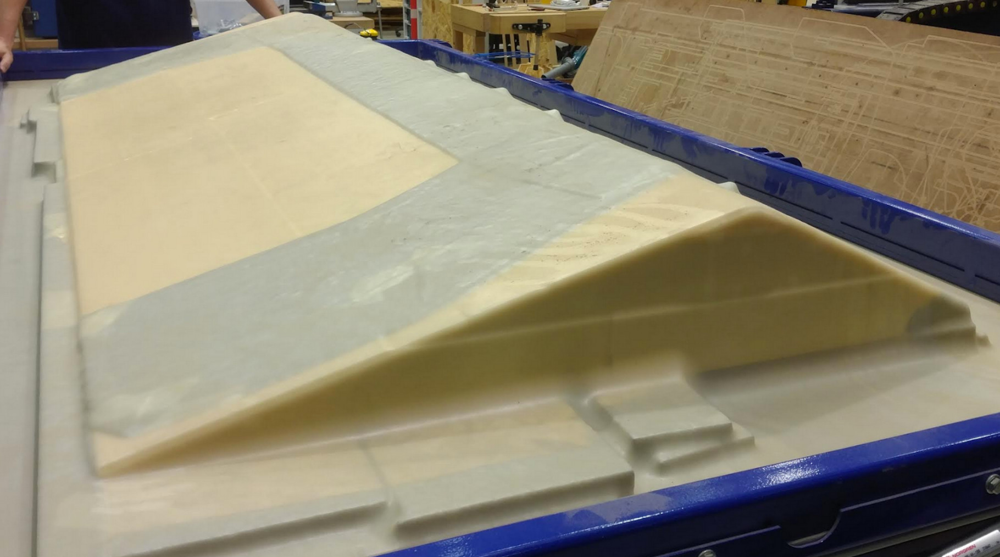

Both fabricated and ready-made parts have been modeled inside the **[LaserDuo Fusion 360 3D model](https://github.com/fab-machines/LaserDuo/raw/master/cad/LaserDuo.f3d)**. Using Fusion is possible to export/prepare the parts for production in the following ways:

- right click save as STL, on a body that needs to be 3D printed
- use the built-in Fusion CAM processor for the machined parts
- project on a surface, and then right click export as DXF, for laser cutting
 
For more details about the tools and once you have all the fabricated and ready-made parts parts available, refer to the for step-by-step assembly instructions and tips: **[LaserDuo Building Manual](https://github.com/fab-machines/LaserDuo/raw/master/docs/LaserDuo%20building%20manual.pdf)** 

LaserDuo requires different fabbable PCBs to work. Below the download links for the eagle files that you use to fabricate them:

- **[satshakit-mega schematic](https://raw.githubusercontent.com/fab-machines/LaserDuo/master/electronics/satshakit-mega/satshakit-mega.sch)**, **[satshakit-mega board](https://raw.githubusercontent.com/fab-machines/LaserDuo/master/electronics/satshakit-mega/satshakit-mega.brd)**

- **[satstep6600 schematic](https://github.com/fab-machines/LaserDuo/raw/master/electronics/satstep6600/satstep6600.sch)**, **[satstep6600 board](https://github.com/fab-machines/LaserDuo/raw/master/electronics/satstep6600/satstep6600.brd)**

- **[satshakit-grbl schematic](https://github.com/fab-machines/LaserDuo/raw/master/electronics/satshakit-grbl/satshakit-grbl.sch)**, **[satshakit-grbl board](https://github.com/fab-machines/LaserDuo/raw/master/electronics/satshakit-grbl/satshakit-grbl.brd)**

Media
--
**LaserDuo Videos**

**How to Make LaserDuo: Hamburg Workshop at [Open Lab](http://openlab-hamburg.de/startpage/)**

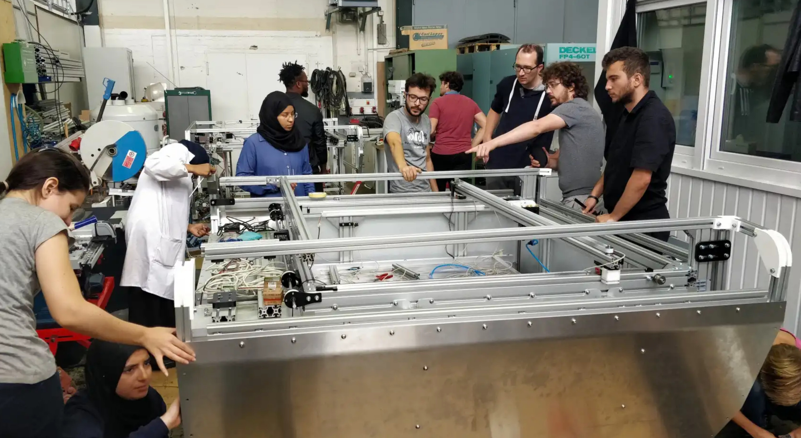
   
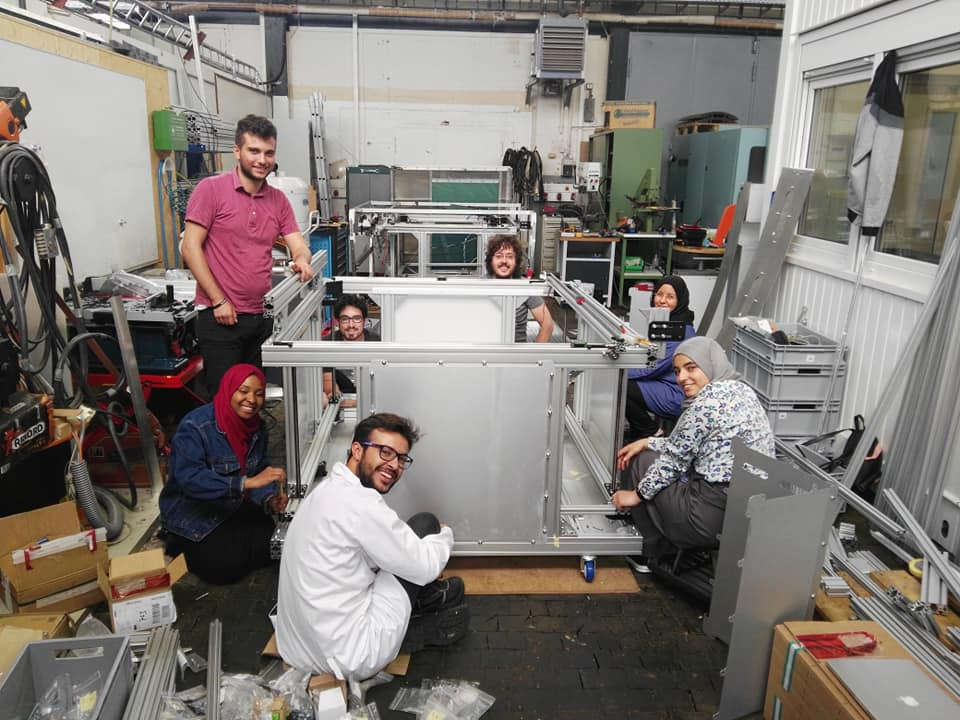

**LaserDuo pictures**

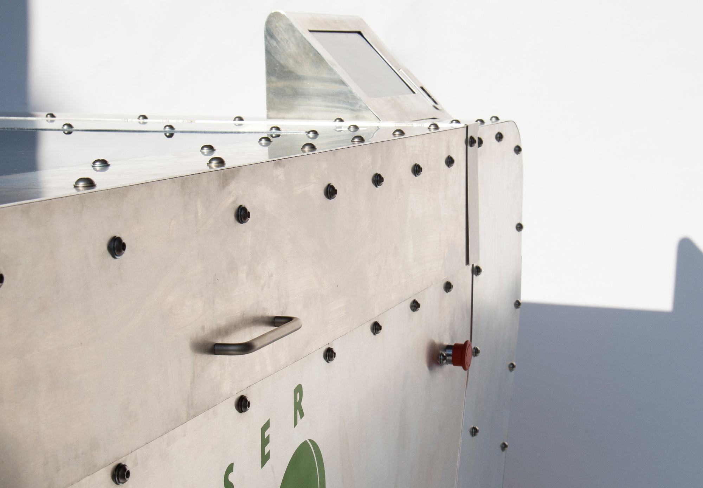

Author
--

**[Daniele Ingrassia](http://www.fabacademy.org/archives/2015/eu/students/ingrassia.daniele/index.html)**

- **ingrassiada@gmail.com**
- **[linkedin](http://it.linkedin.com/in/danieleingrassia)**

Donations
--

Our dream is to have impact by making **open source machines digitally available and locally produced anywhere in world**. We plan to open a dedicated Fab Lab to foster open machine building and digital fabrication research. Practically several tasks and many expensens have to be sustained to give this dream the chance to have a future. Such as the renting of a proper space, the making/purchasing of proper equipment, the sustainability of our work and lifes. If you share this mindset and BigFDM is useful to you, please help us to make this dream a reality by donating your support:

Acknowledgements
--

**Thanks:** 
 
**[Fablab Kamp-Lintfort](https://fablab.hochschule-rhein-waal.de/)** 
Hochschule Rhein-Waal 
Friedrich-Heinrich-Allee 25 
47475 Kamp-Lintfort - Germany 
[https://fablab.hochschule-rhein-waal.de/about-us](https://fablab.hochschule-rhein-waal.de/about-us) 
[fablab@hochschule-rhein-waal.de](fablab@hochschule-rhein-waal.de)

Technical Help by **[Ahmed B. Abdellatif](http://archive.fabacademy.org/fabacademy2017/fablabkamplintfort/students/391/index.html)** 
Logo Design by **Jana-Lina Berkenbusch** 
Photographs by **Christian Spieß** 
Website development by **Emir Rustamov** 

****

License
-- 
LaserDuo is licensed under the terms of the open source license: Creative Commons Attribution-ShareAlike 4.0 International ([CC BY-SA 4.0](https://creativecommons.org/licenses/by-sa/4.0/)).

Note
--

This documentation will be continuously improved as soon there are updates and/or improvements on the machine.

Disclaimer  
--

This hardware/software is provided "as is", and you use the hardware/software at your own risk. Under no circumstances shall any author be liable for direct, indirect, special, incidental, or consequential damages resulting from the use, misuse, or inability to use this hardware/software, even if the authors have been advised of the possibility of such damages.

